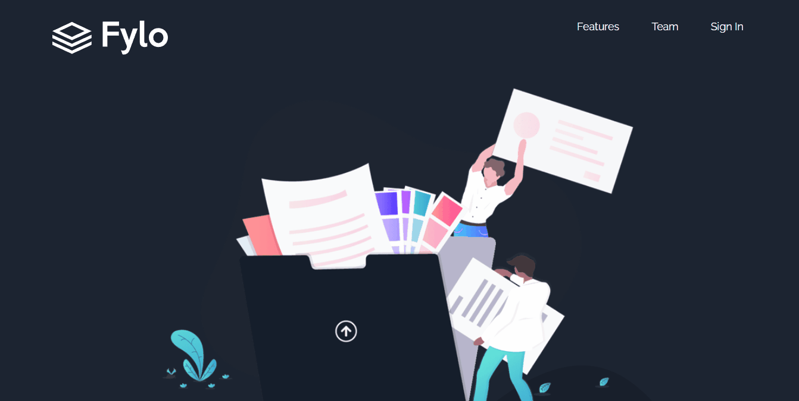

# Desafio Landing Page com Dark Theme - Frontend-Mentor

Este é um desafio de Landing Page com Dark Theme proposto pelo site Frontend-Mentor.

## Tabela de Conteúdos

- [Visão Geral](#visão-geral)
    - [Imagens](#imagens)
    - [Link da página](#link)
- [Processo](#processo)
    - [Linguagens utilizadas](#linguagens-utilizadas)
    - [O que aprendi](#o-que-aprendi)
    - [Possíveis evoluções](#possíveis-evoluções)
- [Autor](#autor)

## Visão-geral

### Imagens

<br>

````
Versão de Desktop
````

   

<br>

````
Versão Mobile
````

 

### Link

- Página no GitHub Pages: <a href="https://julio-mansan2.github.io/landing-page-dark-theme">Clique aqui!</a>

## Processo

### Linguagens utilizadas

<br>

- Marcações semânticas de HTML5
- Propriedades de customização do CSS3
- Estruturas de JavaScript

<br>

### O que aprendi

<br>

- Estilizar utilizando :before:

````css

.quotes::before {
    content: url(../images/bg-quotes.png);
    position: absolute;
    top: -10%;
    left: -2%;
}

````

- Validar um input e-mail:

````html

<form>
    <input type="email" name="email" required id="email" placeholder="email@example.com">
    <input type="submit" id="submit" value="Get Started for Free">
</form>

````
````javascript

const inputSubmit = document.getElementById('submit')
const inputText = document.getElementById('email')
const errorMessage = document.querySelector('.error-message')

inputSubmit.addEventListener ('click', () =>   
{
    event.preventDefault()
    if ((inputText.value === "" || inputText.validity.valid === false)) {            
        errorMessage.classList.remove('valido')
        errorMessage.classList.add("aparecer")
    } else {
        errorMessage.classList.remove("aparecer")
        errorMessage.classList.add('valido')
    }
}
)


````
<br>

### Possíveis evoluções

<br>

- Códigos mais compactos;
- Posicionar melhor os elementos, utilizando assim, menos medições manuais;

<br>

## Autor

GitHub - <a href="https://github.com/julio-mansan2">julio-mansan2</a> <br>
Front-end Mentor - <a href="https://www.frontendmentor.io/profile/julio-mansan2">julio-mansan2</a> <br>
LinkedIn - <a href="https://www.linkedin.com/in/j%C3%BAlio-a-mansan-3415a7249/">Júlio A.</a> <br>